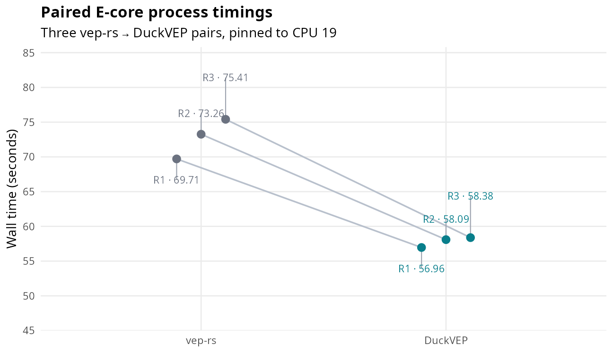
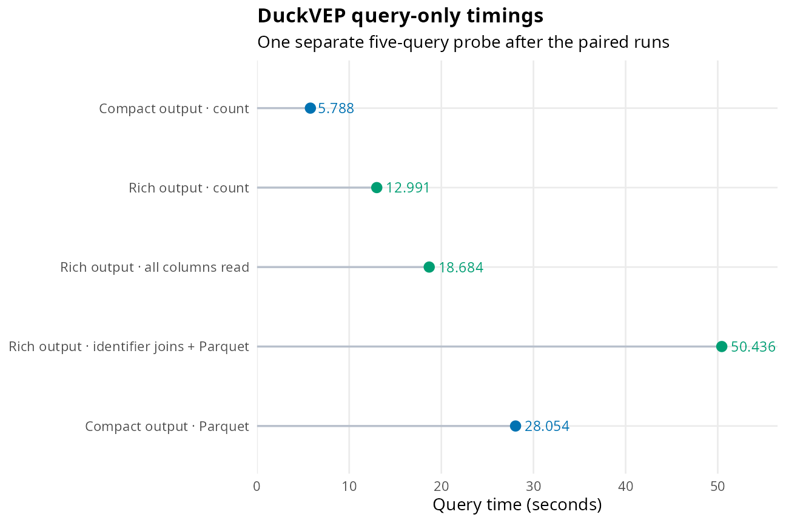
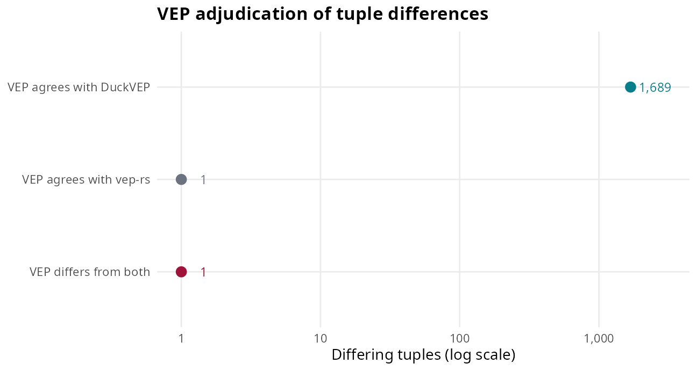
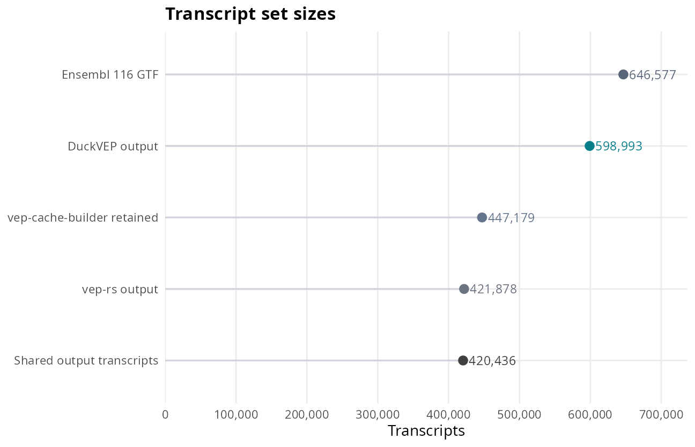

DuckVEP and vep-rs: HG002 Ensembl 116 measurements
================

This is one sites-only HG002 v4.2.1 GRCh38 run: 4,070,522 alleles,
Ensembl 116 annotations, and one ALT allele per record. The tools are
compared as `(allele, transcript, sorted consequence terms)` on
transcripts both emit. DuckVEP writes its rich typed result to Parquet;
vep-rs 0.3.1 writes VEP tab text. Ensembl VEP 116 adjudicates the sites
where their tuples differ.

## Paired single-core timings

Three cold-process pairs ran sequentially on CPU 19, an i5-13500 E-core.
Each dot is one process measurement; connecting lines pair the
repetitions.

<div class="figure" style="text-align: center">


<p class="caption">
Wall time per process. The shared host was busy and output storage was
disk-backed; these measurements describe this run.
</p>

</div>

## Query variants and transcript counts

The separate query-only probe times five complete query variants. Points
are individual measured durations, not additive components.

<div class="figure" style="text-align: center">


<p class="caption">
Each point is a separately timed query variant; extension setup and
model restore are outside these timers. The values are not additive.
</p>

</div>

The comparison contains 34,148,222 tuples per tool on 420,436 shared
transcripts; 34,146,531 tuples match (99.995%). VEP 116 ran on the 1,291
sites with differences.

<div class="figure" style="text-align: center">


<p class="caption">
Oracle verdict counts for the 1,691 differing tuples. The horizontal
count axis is logarithmic.
</p>

</div>

<div class="figure" style="text-align: center">


<p class="caption">
Transcript counts are overlapping set sizes, not disjoint categories.
The GTF and cache-builder totals are reported in the archived run
analysis; output counts are in adjudication.txt.
</p>

</div>

The archived analysis reports 171,530 lncRNA transcripts among those
emitted by DuckVEP and not vep-rs. It did not establish why
`vep-cache-builder` omits transcripts.

<details>
<summary>
Run design and reproduction
</summary>

Render from the repository root with
`Rscript benchmarks/scripts/render_benchmarks.R vep_rs`.

The paired campaign was measured 2026-10-05 with DuckVEP source revision
`bbe2ec4d5e9000c38448edb35e0015f35e8b225e`. Three cold pairs ran vep-rs
first and DuckVEP second, pinned to CPU 19 on an Intel Core i5-13500 (14
cores, 20 threads, 62 GiB; CPU 19 is an E-core with maximum clock 3.5
GHz). The host had other active workloads. Outputs were disk-backed. The
median wall, CPU, and peak RSS measurements are 58.09 s, 57.98 s, and
2,778,116 KiB for DuckVEP; 73.26 s, 70.83 s, and 2,896,592 KiB for
vep-rs.

DuckVEP’s timed process includes extension load, model snapshot restore,
VCF read and coordinate sort, annotation, and Parquet output. Its rich
relation contains consequences, impact, cDNA, CDS and protein positions,
amino acids, and NMD fields. vep-rs uses its 0.3.1 release binary with
`--fork 1` and emits VEP tab text. DuckVEP’s model is built from the
Ensembl core database; the vep-rs JSON cache was built from
`Homo_sapiens.GRCh38.116.gtf.gz`. The release binary’s CPU time matched
a `target-cpu=native` build, and the release already requires AVX2;
vep-rs has no hand-written SIMD, with AVX2 use coming from the compiler
flag and dependencies.

The executable oracle is Ensembl VEP 116 using `--gtf` with the same
GTF. The benchmark inputs are GIAB HG002 v4.2.1 GRCh38 split to one ALT
allele per site. The tools emitted 47,278,065 DuckVEP Parquet rows and
36,258,238 vep-rs text rows; these output contracts differ.
`run_receipt.tsv` records executable and runner hashes;
`preparation.receipt.tsv` and `preparation_outputs.sha256` bind the
input paths, input content hashes, and generated snapshot/mappings.
Those paths are measurement locators.

To reproduce, provide `DUCKVEP_READER_EXT`, `DUCKVEP_MODEL`,
`VEP_RS_CACHE`, `VEP_GTF`, and `VEP_FASTA`, plus `VEP_RS_DIR` or
`VEP_RS_BIN`, as described in
[`benchmark_duckvep_vep_rs.sh`](benchmark_duckvep_vep_rs.sh). Set
`BENCH_OUT` to the intended output filesystem; the runner default is
memory-backed `/dev/shm/duckvep-vep-rs`. Then run:

``` bash
benchmark_duckvep_vep_rs.sh --vcf INPUT.vcf.gz --work WORKDIR --threads 1 --runs 3 --cpu-affinity 19
```

`VEP_RS_CACHE` must point to the species/version directory containing
`transcripts/` (`homo_sapiens/116_GRCh38` for this run), not its parent.
A successful vep-rs exit with no annotation rows is rejected by the
runner. `--fork 1` and `SET threads=1` limit worker counts; only
`--cpu-affinity` binds processes to CPU 19. Without affinity, neither
tool is pinned. With `--threads 16`, that thread setting is measured
before the one-thread comparison, using the same affinity for both tools
and the query probe. Preparation is reused only when its source paths
and SHA-256 hashes match and generated files pass their recorded SHA-256
checks.

`DUCKDB_BIN`, `TIME_BIN`, `TASKSET_BIN`, `VEP_RS_BIN`, and `VEP_BIN`
select alternate executables; `TIME_BIN` must support GNU time’s `-f`,
`-a`, and `-o` options. `VEP_PREFIX` can add the adjudicating VEP
environment to `PATH`. The raw
[`timings.tsv`](data/vep_rs/bbe2ec4_paired/timings.tsv),
[`stage_timings.tsv`](data/vep_rs/bbe2ec4_paired/stage_timings.tsv),
[`adjudication.txt`](data/vep_rs/bbe2ec4_paired/adjudication.txt),
[`run_receipt.tsv`](data/vep_rs/bbe2ec4_paired/run_receipt.tsv), and
[run README](data/vep_rs/bbe2ec4_paired/README.md) retain the
measurement record.

</details>
<details>
<summary>
Agreement details and residual witnesses
</summary>

A tuple is `(allele, transcript, set of consequence terms)`. Counts use
only the 420,436 transcripts emitted by both tools. Each tool has
34,148,222 tuples; 34,146,531 agree and 1,691 differ. VEP ran on 1,291
sites where the tools differed. Its verdicts were 1,689 tuples agreeing
with DuckVEP, one agreeing with vep-rs, and one differing from both.

On those 1,291 sites VEP emitted 41,249 tuples. DuckVEP matches 41,085
and has no rows absent from VEP; 162 VEP rows are for transcripts not
held by DuckVEP’s database-built model. vep-rs matches 38,109 and lacks
1,443 VEP rows; neither tool emits rows absent from VEP in this replay.
The largest disagreement class is 1,317 tuples called synonymous by
DuckVEP and missense by vep-rs; other differences include stop gained or
stop retained terms present on one side only.

The two remaining mismatches have [two-record
witnesses](../test/duckvep/conformance/veprs_residual_witness.vcf):

- `e284879 / ENST00000696609`: a UTR/start deletion leaves an upstream
  `ATG` before the original CDS suffix. DuckVEP emits both start terms;
  VEP and vep-rs emit only `start_lost`.
- `e391762 / ENST00001011173`: deleting the middle base of a terminal
  `TGA` leaves local `TA`; sequence replay uses the next base to form
  `TAG`. DuckVEP calls the stop retained, VEP calls it lost, and vep-rs
  also adds a frameshift term.

[Diagnostic SQL](../test/duckvep/conformance/veprs_residual_witness.sql)
reproduces DuckVEP’s rows from the runner snapshot and mappings. Load
the extension and set SQL variable `comparison_dir` before running it
from the repository root. Direct VEP 116 reruns reproduce both oracle
rows. The differing sequence contexts are identified; VEP’s internal
shifted allele operands remain unresolved.

</details>
<details>
<summary>
Historical memory-backed measurements
</summary>

A separate campaign dated 2026-10-04 used DuckVEP revision `125e34a` on
the same i5-13500 with outputs on memory-backed storage. At 16 threads,
median wall times were 6.84 s for DuckVEP and 9.39 s for vep-rs; CPU
time was 71 s and 105 s, and peak RSS was 4.9 GiB and 3.5 GiB. DuckVEP
wrote 47,278,065 rows (142 MB Parquet); vep-rs wrote 36,258,238 rows
(4.17 GB text). The output formats and row counts differ. DuckVEP’s
resident memory includes a 1.3 GiB model file mapping shared between
processes.

The separate one-thread measurements were DuckVEP: 33.5 s wall, 33.5 s
CPU, 2.6 GiB peak RSS; vep-rs `--fork 1`: 30.0 s wall, 53.3 s CPU, 3.1
GiB peak RSS; vep-rs pinned to one core: 34.4 s wall and 34.4 s CPU. The
pinned vep-rs and DuckVEP timings came from separate invocations and are
not a controlled one-core pair. The 33.53 s and 102.86 s timings
recorded for separate invocations also do not establish a controlled
comparison. vep-rs 0.3.1 did not accept `--parquet`, so the output
formats are not identical.

A historical DuckVEP single-thread query probe, without CPU affinity,
measured compact count 3.4 s, rich count 8.0 s, rich-column touch 11.4
s, rich joined Parquet 30.3 s, and compact Parquet 15.5 s. Extension
setup and model restore were outside these query timers; the query
variants are not additive.

vep-rs’s published concordance describes release 115 and 1.18 billion
variants. HGVS, regulatory features, and plugins are outside this
comparison. Tuples on which these tools agree were not checked against
VEP; the oracle adjudication is limited to the disagreement sites in
this one genome.

</details>

The R Markdown source renders this report and its figures from the
checked-in receipts:

``` r
rmarkdown::render("benchmarks/benchmark_duckvep_vep_rs.Rmd",
  output_file = "benchmark_duckvep_vep_rs.md", output_dir = "benchmarks",
  knit_root_dir = normalizePath("."), envir = new.env(parent = globalenv()))
```
