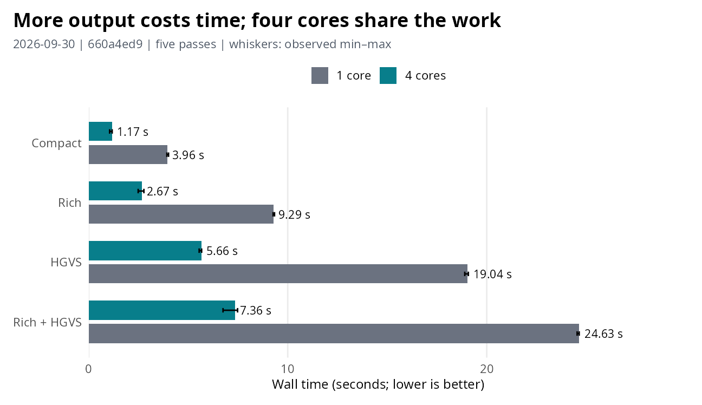
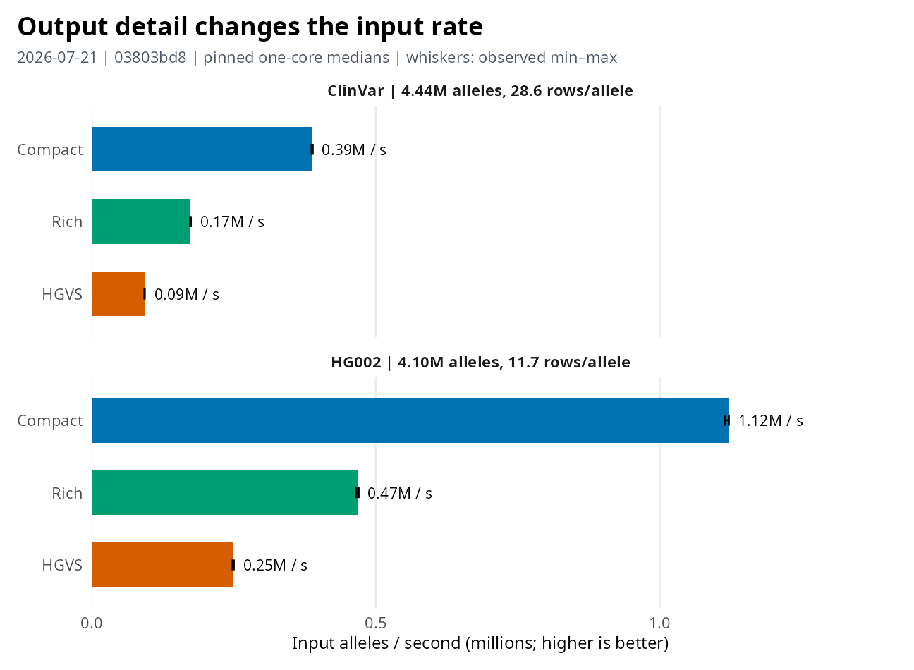
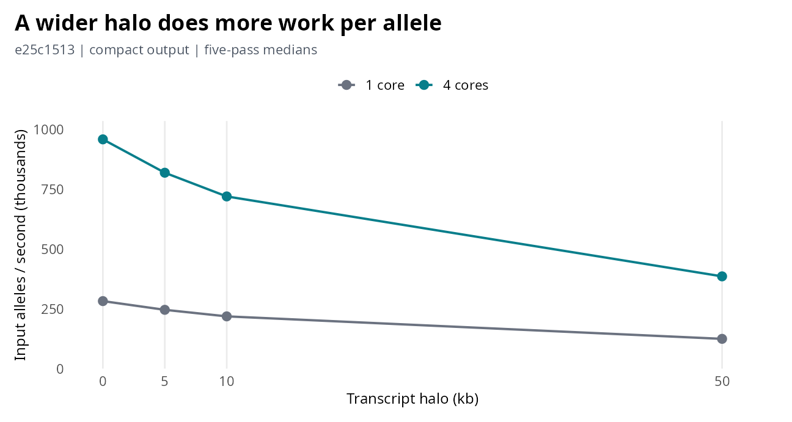
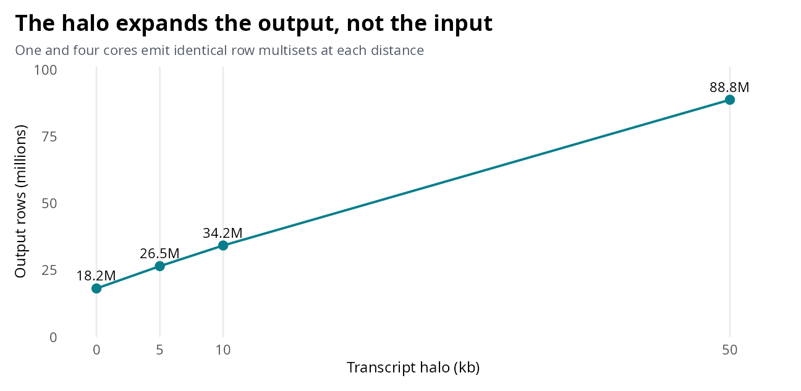
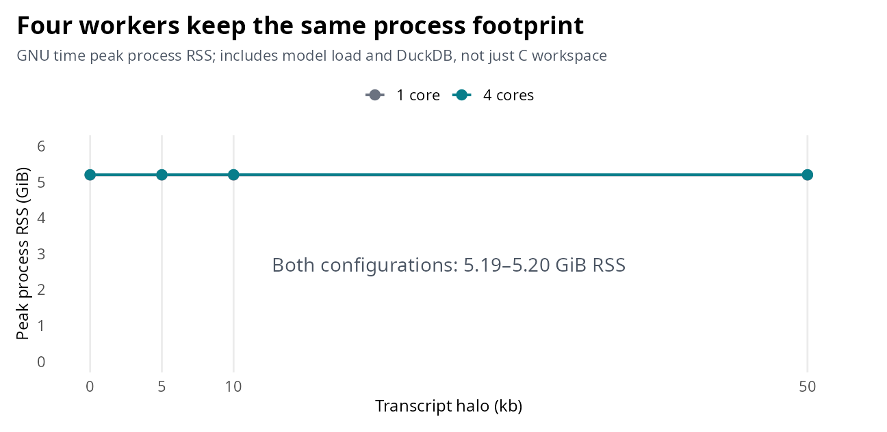
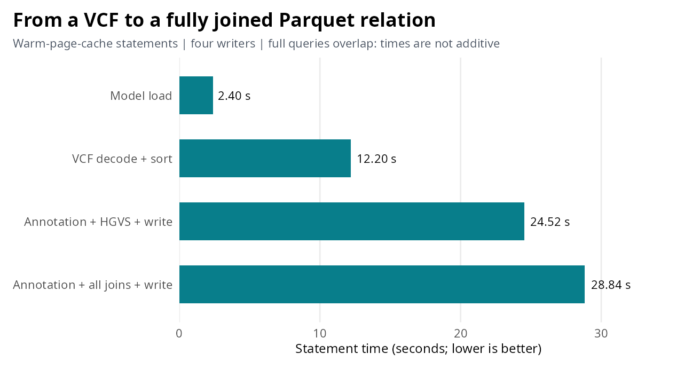
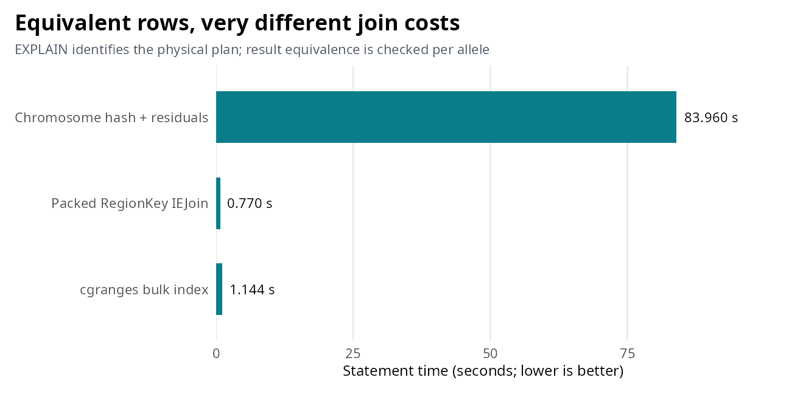
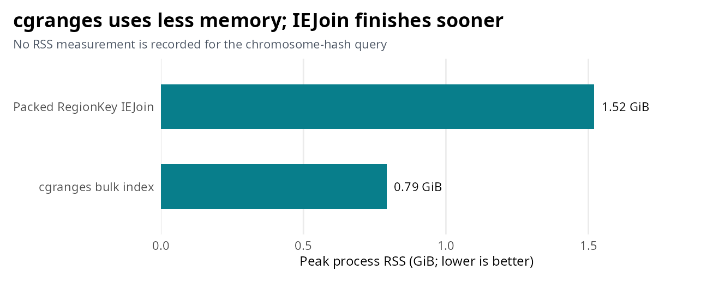

DuckVEP throughput
================

<!-- duckvep_throughput.md is generated from duckvep_throughput.Rmd. -->

**Throughput depends on the output you request and the rows each allele
produces.** The charts separate pinned resident annotation from
dense-region threading and whole-genome composition. [Methods,
measurement scope and reproduction](duckvep_throughput_evidence.md)
cover the details; [CSV receipts](data/duckvep_throughput.csv) retain
every recorded run.

## Public relation API cost and scaling

The same HG002 relation emits 47,835,851 rows at either worker count.
Compact, rich, HGVS and fused rich+HGVS each pass their cross-thread
output checks.



The public relation dispatcher distributes ordered input across workers.
One core is pinned to CPU 2; four cores to 2,4,6,8. The receipt records
CPU-set contention.

## Full-corpus core VEP model

These one-core measurements use the complete Ensembl 116 GRCh38
transcript, regulatory and motif model. Timers include result production
and aggregation; loading and file ingestion are outside the measurement.



Rows per allele differ between corpora. An input rate alone does not
describe the amount of output produced.

## Dense-region threading and halo

This fixture has 517,097 ClinVar alleles in 318 annotation-dense tiles.
Each halo pairs one core with four ordered partitions; matching
fingerprints verify the same output rows.







Measurements cover these halos and four partitions on the
annotation-dense panel. RSS differences are process measurements, not
allocation attribution.

## Real whole-genome composition run

A separate DeepVariant HG002 WGS run writes complete rich+HGVS output
joined to ClinVar, ClinvArbitration, AlphaMissense, gene constraint and
Ensembl regulation. It uses four writers, warm page cache and no CPU
pinning.



The all-provider query writes 88,392,840 rows in 28.84 seconds, with
5.31 GiB peak RSS. These are integration measurements, separate from the
pinned resident rates.

## Interval join plans

All three implementations return the same 745,252 overlap pairs and
match the same 414,813 alleles. The physical join plan controls the
work.





## Evidence and reproduction

[Methods and scope](duckvep_throughput_evidence.md) define the timers,
output surfaces and equality checks. CSVs retain full provenance and raw
measurements: [resident annotation](data/duckvep_throughput.csv), [dense
threading](data/duckvep_dense_threading.csv), [whole-genome
statements](data/duckvep_human_annotation.csv), and [interval
equivalence](data/duckvep_human_interval_validation.csv).

Render the plots and this report from the repository root:

``` sh
Rscript benchmarks/scripts/render_benchmarks.R throughput
```
